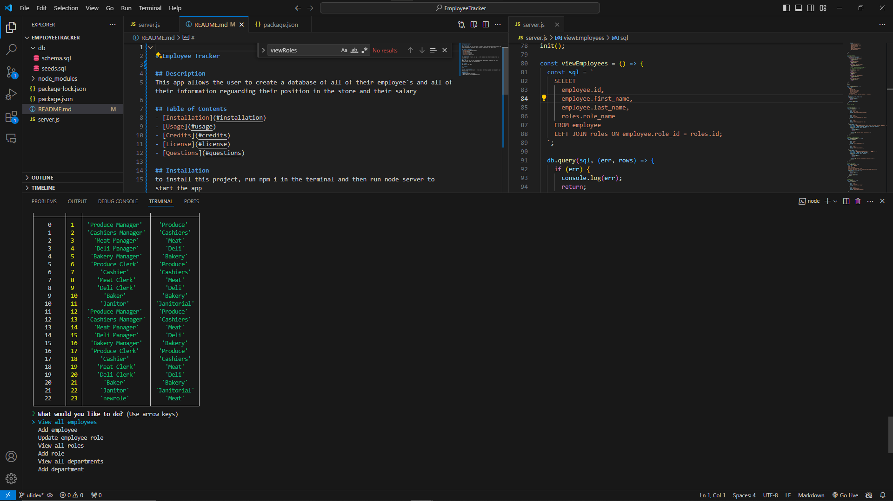

# Employee Tracker

## Description
This app allows the user to create a database of all of their employee's and all of their information reguarding their position in the store and their salary

## Table of Contents
- [Installation](#installation)
- [Usage](#usage)
- [Credits](#credits)
- [License](#license)
- [Questions](#questions)

## Installation
to install this project, run npm i in the terminal and then run node server to start the app

## Usage
With this app you are able to add employees, departments, and roles for your store's staff to be very well managed

## Credits
No, just me and Xpert

## Licenses
none

## How to contribute
others can perhaps integrate a front end so that this could be used in a more user friendly way

### Questions
- GitHub Username: ulisesd15
- Email Address: ulisesd404@gmail.com
